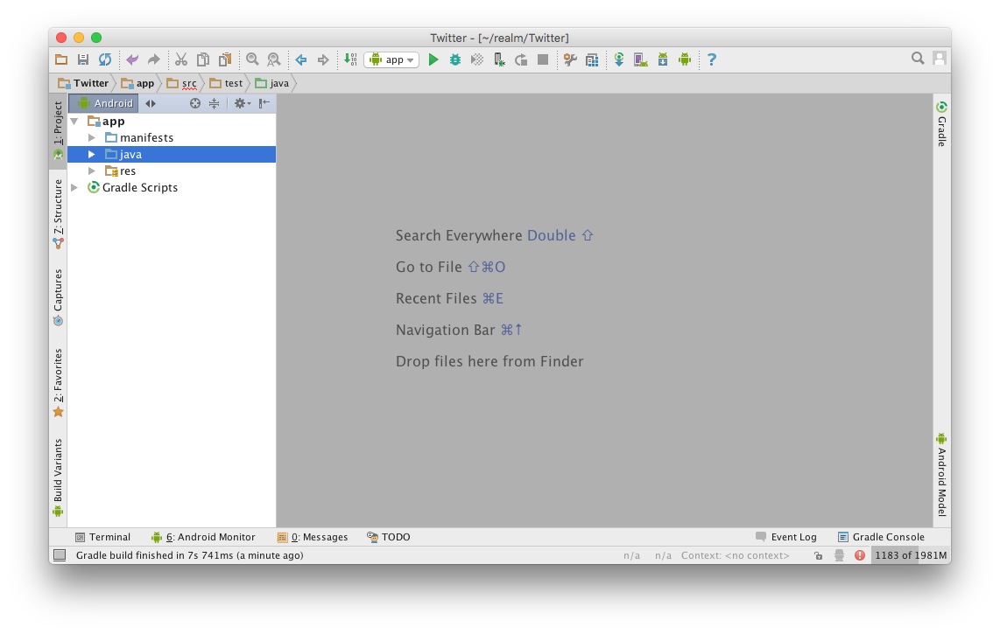
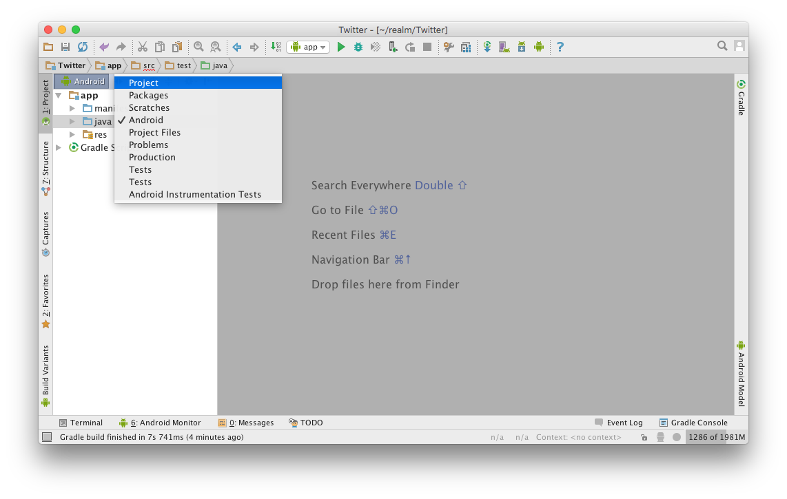
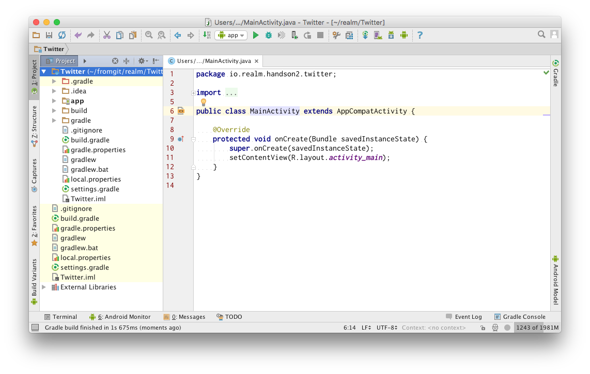
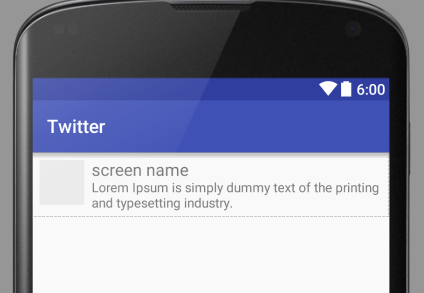
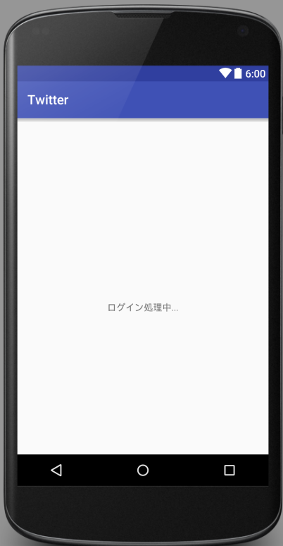

[https://github.com/zaki50/Realm-Hands-On2_android](https://github.com/zaki50/Realm-Hands-On2_android)에서 코드를 다운로드할 수 있습니다. 또한 각 장에 대응 한 커밋이 master 브랜치 커밋들로 존재하기 때문에 각 부분까지의 경과를 확인할  수 있습니다.

# 1. 프로젝트 만들기

다음의 설정에서 Android Studio에서 새 프로젝트를 만듭니다.

<dl>
  <dt>Application name</dt>
  <dd>Twitter</dd>
  <dt>Company Domain</dt>
  <dd>handson2.realm.io</dd>
  <dt>Minimum SDK</dt>
  <dd>15</dd>
  <dt>Activity type</dt>
  <dd>Empty Activity</dd>
</dl>



프로젝트를 만든 후 왼쪽의 Project View에서 `Android`로 설정된 것을 `Project`로 변경합니다. 이렇게하면 실제 디렉토리 구성과 일치 한 상태로 표시 됩니다.





여기까지 진행한 후 일단 `Tools > Android > Sync Project with Gradle Files`를 실행하여 오류없이 빌드가 되는지 확인합니다.

그리고 이 단계에서 응용 프로그램 실행이 정상적인지 확인합시다.

# 2. Realm 설치

Gradle 플러그인을 적용하여 Realm을 사용해봅시다.

`./build.gradle`의 `buildscript.dependencies`에 들어가는 `classpath 'io.realm:realm-gradle-plugin:1.2.0'`에 대해 설명합니다. 이 선언에 의해 사용하는 Realm의 버전이 결정됩니다. 추가를 하면 다음과 같습니다.

```
// Top-level build file where you can add configuration options common to all sub-projects/modules.

buildscript {
    repositories {
        jcenter()
    }
    dependencies {
        classpath 'com.android.tools.build:gradle:2.1.2'
        classpath 'io.realm:realm-gradle-plugin:1.2.0'

        // NOTE: Do not place your application dependencies here; they belong
        // in the individual module build.gradle files
    }
}

allprojects {
    repositories {
        jcenter()
    }
}

task clean(type: Delete) {
    delete rootProject.buildDir
}
```

다음으로 `app/build.gradle` 두 번째 행에 `apply plugin: 'realm-android'`를 추가합시다. 이 선언은 `apply plugin: 'com.android.application'` 다음에 와야 합니다.

```
apply plugin: 'com.android.application'
apply plugin: 'realm-android'

android {
    compileSdkVersion 23
    buildToolsVersion "24.0.1"

    defaultConfig {
        applicationId "io.realm.handson2.twiiter"
        minSdkVersion 15
        targetSdkVersion 23
        versionCode 1
        versionName "1.0"
    }
    buildTypes {
        release {
            minifyEnabled false
            proguardFiles getDefaultProguardFile('proguard-android.txt'), 'proguard-rules.pro'
        }
    }
}

dependencies {
    compile fileTree(dir: 'libs', include: ['*.jar'])
    testCompile 'junit:junit:4.12'
    compile 'com.android.support:appcompat-v7:23.4.0'
}
```

여기까지 진행하였으면  `Tools > Android > Sync Project with Gradle Files`를 실행하여 오류없이 빌드가능한지 확인합시다.

이제 Realm을 사용할 준비가 되었습니다.

# 3. 타임 라인 보기 작성

3장에서는 Twitter의 화면 표시 부분을 진행하고 있습니다.

## 3.1 레이아웃 파일 만들기

`app/main/res/layout/activity_main.xml`을 열고 기술된 부분을 제거하고 ViewPager와 PagerTitleStrip를 배치합니다.

```
<?xml version="1.0" encoding="utf-8"?>
<android.support.v4.view.ViewPager
    android:id="@+id/pager"
    xmlns:android="http://schemas.android.com/apk/res/android"
    xmlns:tools="http://schemas.android.com/tools"
    android:layout_width="match_parent"
    android:layout_height="match_parent"
    tools:context="io.realm.handson2.twitter.MainActivity">

    <android.support.v4.view.PagerTitleStrip
        android:id="@+id/pager_title_strip"
        android:layout_width="match_parent"
        android:layout_height="wrap_content"
        android:layout_gravity="top"
        android:paddingBottom="4dp"
        android:paddingTop="4dp"/>

</android.support.v4.view.ViewPager>
```

다음으로 하나의 트윗에 해당하는 레이아웃 `app/main/res/layout/listitem_tweet.xml`을 만듭니다.

```
<?xml version="1.0" encoding="utf-8"?>
<RelativeLayout xmlns:android="http://schemas.android.com/apk/res/android"
                xmlns:tools="http://schemas.android.com/tools"
                android:layout_width="match_parent"
                android:layout_height="wrap_content"
                android:orientation="vertical"
                android:padding="8dp">

    <ImageView
        android:id="@+id/image"
        android:layout_width="48dp"
        android:layout_height="48dp"
        android:layout_alignParentLeft="true"
        android:layout_alignParentStart="true"
        android:layout_alignParentTop="true"
        android:background="#10000000"
        tools:ignore="ContentDescription"/>

    <TextView
        android:id="@+id/screen_name"
        android:layout_width="match_parent"
        android:layout_height="wrap_content"
        android:layout_alignParentEnd="true"
        android:layout_alignParentRight="true"
        android:layout_marginLeft="8dp"
        android:layout_marginStart="8dp"
        android:layout_toEndOf="@id/image"
        android:layout_toRightOf="@id/image"
        android:textAppearance="?android:attr/textAppearanceMedium"
        tools:text="screen name"/>

    <TextView
        android:id="@+id/text"
        android:layout_width="match_parent"
        android:layout_height="wrap_content"
        android:layout_alignLeft="@id/screen_name"
        android:layout_alignParentEnd="true"
        android:layout_alignParentRight="true"
        android:layout_alignStart="@id/screen_name"
        android:layout_below="@id/screen_name"
        android:textAppearance="?android:attr/textAppearanceSmall"
        tools:text="Lorem Ipsum is simply dummy text of the printing and typesetting industry."/>

</RelativeLayout>
```



레이아웃은 다 준비되었습니다. 이제 자바 코드를 작성합시다.

## 3.2 자바 코드

ViewPager의 내용이 되는 Fragment를 `app/main/src/java/`에 `io.realm.handson2.twitter.TimelineFragment` 클래스로 다음과 같이 만듭니다.

```
package io.realm.handson2.twitter;

import android.os.Bundle;
import android.support.annotation.Nullable;
import android.support.v4.app.ListFragment;
import android.widget.ArrayAdapter;
import android.widget.ListAdapter;

import java.util.Arrays;

public class TimelineFragment extends ListFragment {

    @Override
    public void onCreate(@Nullable Bundle savedInstanceState) {
        super.onCreate(savedInstanceState);

        final ListAdapter adapter = new ArrayAdapter<String>(getContext(),
                R.layout.listitem_tweet,
                R.id.text,
                Arrays.asList("Lorem Ipsum is simply dummy text of the printing and typesetting industry.",
                        "Lorem Ipsum is simply dummy text of the printing and typesetting industry.",
                        "Lorem Ipsum is simply dummy text of the printing and typesetting industry.",
                        "Lorem Ipsum is simply dummy text of the printing and typesetting industry.",
                        "Lorem Ipsum is simply dummy text of the printing and typesetting industry.",
                        "Lorem Ipsum is simply dummy text of the printing and typesetting industry.",
                        "Lorem Ipsum is simply dummy text of the printing and typesetting industry.",
                        "Lorem Ipsum is simply dummy text of the printing and typesetting industry.",
                        "Lorem Ipsum is simply dummy text of the printing and typesetting industry.",
                        "Lorem Ipsum is simply dummy text of the printing and typesetting industry.",
                        "Lorem Ipsum is simply dummy text of the printing and typesetting industry.",
                        "Lorem Ipsum is simply dummy text of the printing and typesetting industry.",
                        "Lorem Ipsum is simply dummy text of the printing and typesetting industry.",
                        "Lorem Ipsum is simply dummy text of the printing and typesetting industry.",
                        "Lorem Ipsum is simply dummy text of the printing and typesetting industry.",
                        "Lorem Ipsum is simply dummy text of the printing and typesetting industry.",
                        "Lorem Ipsum is simply dummy text of the printing and typesetting industry.",
                        "Lorem Ipsum is simply dummy text of the printing and typesetting industry.",
                        "Lorem Ipsum is simply dummy text of the printing and typesetting industry.",
                        "Lorem Ipsum is simply dummy text of the printing and typesetting industry."
                ));

        setListAdapter(adapter);
    }
}
```

마지막으로 `MainActvity.java`을 열어 `MainPagerAdapter` 클래스를 추가하고 `onCreate()`에서 이를 등록합시다.

```
private static final class MainPagerAdapter extends FragmentStatePagerAdapter {

    public MainPagerAdapter(FragmentManager fm) {
        super(fm);
    }

    @Override
    public int getCount() {
        return 1;
    }

    @Override
    public CharSequence getPageTitle(int position) {
        switch (position) {
            case 0:
                return "타임라인";
            default:
                throw new RuntimeException("unexpected position: " + position);
        }
    }

    @Override
    public Fragment getItem(int position) {
        switch (position) {
            case 0:
                return new TimelineFragment();
            default:
                throw new RuntimeException("unexpected position: " + position);
        }
    }
}
```

`MainActivity#onCreate()` 끝에 다음 코드를 추가합니다.

```
final ViewPager pager = (ViewPager) findViewById(R.id.pager);
//noinspection ConstantConditions
pager.setAdapter(new MainPagerAdapter(getSupportFragmentManager()));
```

# 4. Twitter4J 설치

## 4.1 Twitter4J를 추가

먼저 Twitter4j를 사용가능하게 합시다.

`app/build.gradle`의 `dependencies`에 `compile 'org.twitter4j:twitter4j-core:4.0.4'`을 추가합니다.

의존성을 추가하면 아래와 같게 됩니다.

```
apply plugin: 'com.android.application'
apply plugin: 'realm-android'

android {
    compileSdkVersion 23
    buildToolsVersion "24.0.1"

    defaultConfig {
        applicationId "io.realm.handson2.twiiter"
        minSdkVersion 15
        targetSdkVersion 23
        versionCode 1
        versionName "1.0"
    }
    buildTypes {
        release {
            minifyEnabled false
            proguardFiles getDefaultProguardFile('proguard-android.txt'), 'proguard-rules.pro'
        }
    }
}

dependencies {
    compile fileTree(dir: 'libs', include: ['*.jar'])
    testCompile 'junit:junit:4.12'
    compile 'com.android.support:appcompat-v7:23.4.0'
    compile 'org.twitter4j:twitter4j-core:4.0.4'
}
```

`Tools > Android > Sync Project with Gradle Files`를 실행합시다.

## 4.2 유틸리티 클래스 만들기

`TwitterAuthUtil` 클래스를 다음과 같게 만듭시다. 이 클래스는 인증에 필요한 정보를 SharedPreferences에 저장하는 것 등을 지원합니다.

```
package io.realm.handson2.twitter;

import android.app.Application;
import android.content.Context;
import android.content.SharedPreferences;

import twitter4j.auth.AccessToken;
import twitter4j.auth.RequestToken;

public final class TwitterAuthUtil {
    private static Application app;

    private static final String PREF_NAME = "auth";
    private static final String KEY_REQUEST_TOKEN = "requestToken";
    private static final String KEY_REQUEST_TOKEN_SECRET = "requestTokenSecret";
    private static final String KEY_ACCESS_TOKEN = "accessToken";
    private static final String KEY_ACCESS_TOKEN_SECRET = "accessTokenSecret";
    private static final String KEY_ACCESS_USER = "accessUser";

    public static void init(Application app) {
        TwitterAuthUtil.app = app;
    }

    public static String getCallbackUrlString() {
        return app.getPackageName() + ".callback://CallBackActivity";
    }

    public synchronized static void saveRequestToken(RequestToken requestToken) {
        getPreference().edit()
                .putString(KEY_REQUEST_TOKEN, requestToken.getToken())
                .putString(KEY_REQUEST_TOKEN_SECRET, requestToken.getTokenSecret())
                .apply();
    }

    public synchronized static RequestToken loadRequestToken() {
        final SharedPreferences pref = getPreference();

        final String token = pref.getString(KEY_REQUEST_TOKEN, null);
        final String secret = pref.getString(KEY_REQUEST_TOKEN_SECRET, null);
        if (token == null || secret == null) {
            return null;
        }
        return new RequestToken(token, secret);
    }

    public synchronized static void saveAccessToken(AccessToken accessToken) {
        getPreference().edit()
                .putString(KEY_ACCESS_TOKEN, accessToken.getToken())
                .putString(KEY_ACCESS_TOKEN_SECRET, accessToken.getTokenSecret())
                .putLong(KEY_ACCESS_USER, accessToken.getUserId())
                .apply();
    }

    public synchronized static AccessToken loadAccessToken() {
        final SharedPreferences pref = getPreference();

        final String token = pref.getString(KEY_ACCESS_TOKEN, null);
        final String secret = pref.getString(KEY_ACCESS_TOKEN_SECRET, null);
        if (token == null || secret == null) {
            return null;
        }
        return new AccessToken(token, secret, pref.getLong(KEY_ACCESS_USER, -1L));
    }

    public synchronized static void clearTokens() {
        getPreference().edit()
                .clear()
                .apply();
    }

    private static SharedPreferences getPreference() {
        return app.getSharedPreferences(PREF_NAME, Context.MODE_PRIVATE);
    }
}
```

## 4.3 Application 클래스 초기화

`MyApplication` 클래스를 작성하여 유틸리티 클래스와 Twitter4J를 초기화합니다. `<consumerKey>`와 `<consumerSecret>` 부분을 각자의 값으로 변경하세요. 값을 얻는 방법은 아래의 코드 다음에 설명합니다.

```
package io.realm.handson2.twitter;

import android.app.Application;

import twitter4j.TwitterFactory;

public class MyApplication extends Application {

    @Override
    public void onCreate() {
        super.onCreate();

        TwitterAuthUtil.init(this);

        TwitterFactory.getSingleton().setOAuthConsumer(
                "<consumerKey>",
                "<consumerSecret>");
    }
}
```

이 클래스를 `AndroidManifest.xml`에 추가하세요.

```
<?xml version="1.0" encoding="utf-8"?>
<manifest package="io.realm.handson2.twitter"
          xmlns:android="http://schemas.android.com/apk/res/android">

    <application
        android:name=".MyApplication"
(중략)
```

## 4.4 소비자 키 받기

`<consumerKey>`와 `<consumerSecret>`를 받기 위해 [https://apps.twitter.com/](https://apps.twitter.com/)에 방문하여 `Create New App`를 누릅니다.

다음의 설정으로 작성하십시오. `Callback URL`은 필수는 아니지만 비워두면 응용 프로그램에서 인증이 안되기 때문에 유효한 URL을 입력하십시오.

**Name은 중복이 되지 않기 때문에 각가 적당한 이름을 선택하세요**

<dl>
  <dt>Name</dt>
  <dd>RealmHandsOn</dd>
  <dt>Description</dt>
  <dd>sample application for realm hands-on</dd>
  <dt>Website</dt>
  <dd>http://www.realm.io/</dd>
  <dt>Callback URL</dt>
  <dd>http://www.realm.io/</dd>
</dl>

작성을 완료하고 `Keys and Access Tokens` 탭을 선택하여 화면에 표시된 `<consumerKey>`와 `<consumerKey>`를 획득합니다. 방금 전 작성했던 `MyApplication` 클래스의 문자열을 바꿉시다.

# 5. 로그인 화면 만들기

이제 로그인 화면을 만듭시다.

Twitter 로그인은 브라우저를 사용할 것이기 때문에 화면은 매우 간단합니다. 가운데 LOGIN라고 쓰여진 버튼을 하나 놓은 구성을 `app/main/res/layout/activity_login.xml`라고 작성합시다.

```
<?xml version="1.0" encoding="utf-8"?>
<FrameLayout
    xmlns:android="http://schemas.android.com/apk/res/android"
    xmlns:tools="http://schemas.android.com/tools"
    android:layout_width="match_parent"
    android:layout_height="match_parent"
    tools:context="io.realm.handson2.twitter.LoginActivity">

    <Button
        android:id="@+id/login"
        android:layout_width="wrap_content"
        android:layout_height="wrap_content"
        android:layout_gravity="center"
        android:text="Login"
        tools:ignore="HardcodedText"/>

</FrameLayout>
```

위 레이아웃을 사용하는 클래스 `LoginActivity`를 작성합시다.

```
package io.realm.handson2.twitter;

import android.content.Intent;
import android.net.Uri;
import android.os.AsyncTask;
import android.os.Bundle;
import android.support.v7.app.AppCompatActivity;
import android.util.Log;
import android.view.View;
import android.widget.Toast;

import twitter4j.Twitter;
import twitter4j.TwitterException;
import twitter4j.TwitterFactory;
import twitter4j.auth.AccessToken;
import twitter4j.auth.RequestToken;

public class LoginActivity extends AppCompatActivity {

    @Override
    protected void onCreate(Bundle savedInstanceState) {
        super.onCreate(savedInstanceState);

        final AccessToken accessToken = TwitterAuthUtil.loadAccessToken();
        if (accessToken != null) {
            /*
               엑세스 토큰이 저장되어 있는 경우나
               인증을 성공한 경우 여기를 지나간다.
            */
            TwitterFactory.getSingleton().setOAuthAccessToken(accessToken);
            startActivity(new Intent(this, MainActivity.class));
            finish();
            return;
        }

        setContentView(R.layout.activity_login);

        final View button = findViewById(R.id.login);
        //noinspection ConstantConditions
        button.setOnClickListener(new View.OnClickListener() {
            @Override
            public void onClick(View v) {
                executeLogin();
            }
        });
    }

    private void executeLogin() {
        new AsyncTask<Void, Throwable, Void>() {
            @Override
            protected Void doInBackground(Void... params) {
                TwitterAuthUtil.clearTokens();
                final Twitter twitter = TwitterFactory.getSingleton();
                try {
                    final RequestToken requestToken = twitter.getOAuthRequestToken(
                            TwitterAuthUtil.getCallbackUrlString());
                    final String authUrl = requestToken.getAuthorizationURL();
                    TwitterAuthUtil.saveRequestToken(requestToken);
                    startActivity(new Intent(Intent.ACTION_VIEW, Uri.parse(authUrl)));
                } catch (TwitterException e) {
                    Log.e("RealmTwitter", "통신 오류가 발생했습니다: " + e.getMessage());
                    publishProgress(e);
                }
                return null;
            }

            @Override
            protected void onProgressUpdate(Throwable... values) {
                super.onProgressUpdate(values);

                Toast.makeText(LoginActivity.this,
                        "통신 오류가 발생했습니다: " + values[0].getMessage(), Toast.LENGTH_LONG).show();
            }
        }.execute();
    }
}
```

이 클래스를 `AndroidManifest.xml`에 등록합시다. 지금까지 수행되는 액티비티는 `MainActivity` 뿐이었지만 방금 작성한 `LoginActivity`가 수행되도록 MAIN 인텐트 필터를 이동합니다.

동시에 `INTERNET` 권한을 추가합니다.

```
<?xml version="1.0" encoding="utf-8"?>
<manifest xmlns:android="http://schemas.android.com/apk/res/android"
    package="io.realm.handson2.twitter">

    <uses-permission android:name="android.permission.INTERNET"/>

    <application
        android:name=".MyApplication"
        android:allowBackup="true"
        android:icon="@mipmap/ic_launcher"
        android:label="@string/app_name"
        android:supportsRtl="true"
        android:theme="@style/AppTheme">

        <activity android:name=".LoginActivity">
            <intent-filter>
                <action android:name="android.intent.action.MAIN"/>

                <category android:name="android.intent.category.LAUNCHER"/>
            </intent-filter>
        </activity>

        <activity android:name=".MainActivity"/>
    </application>

</manifest>
```

## 5.2 콜백 화면

브라우저에서 결과를 받아 수행할 화면을 만듭니다. 가운데 진행중 메시지가 있는 화면입니다.



아래 내용으로 `app/main/res/layout/activity_callback.xml`를 작성하십시요.

```
<?xml version="1.0" encoding="utf-8"?>
<RelativeLayout
    xmlns:android="http://schemas.android.com/apk/res/android"
    xmlns:tools="http://schemas.android.com/tools"
    android:layout_width="match_parent"
    android:layout_height="match_parent"
    tools:context="io.realm.handson2.twitter.LoginActivity">

    <ProgressBar
        android:id="@+id/progress"
        android:layout_width="wrap_content"
        android:layout_height="wrap_content"
        android:layout_centerInParent="true"
        android:indeterminate="true"/>

    <TextView
        android:id="@+id/text"
        android:layout_width="wrap_content"
        android:layout_height="wrap_content"
        android:layout_below="@id/progress"
        android:layout_centerHorizontal="true"
        android:text="로그인 처리 중..."
        tools:ignore="HardcodedText"/>

</RelativeLayout>
```

`CallbackActivity` 클래스를 만듭시다.

```
package io.realm.handson2.twitter;

import android.content.Intent;
import android.net.Uri;
import android.os.AsyncTask;
import android.os.Bundle;
import android.support.v7.app.AppCompatActivity;
import android.util.Log;
import android.widget.Toast;

import twitter4j.Twitter;
import twitter4j.TwitterException;
import twitter4j.TwitterFactory;
import twitter4j.auth.AccessToken;
import twitter4j.auth.RequestToken;

public class CallbackActivity extends AppCompatActivity {

    @Override
    protected void onCreate(Bundle savedInstanceState) {
        super.onCreate(savedInstanceState);
        setContentView(R.layout.activity_callback);

        final Uri uri = getIntent().getData();
        if (uri == null || !uri.toString().startsWith(TwitterAuthUtil.getCallbackUrlString())) {
            Toast.makeText(this, "unexpected Uri in Intent: " + uri, Toast.LENGTH_SHORT).show();
            finish();
            return;
        }

        final String verifier = uri.getQueryParameter("oauth_verifier");

        final RequestToken requestToken = TwitterAuthUtil.loadRequestToken();
        TwitterAuthUtil.clearTokens();
        if (requestToken == null) {
            Toast.makeText(this, "RequestToken 읽기를 실패했습니다.", Toast.LENGTH_SHORT).show();
            finish();
            return;
        }

        new AsyncTask<Void, Throwable, Void>() {
            @Override
            protected Void doInBackground(Void... params) {
                try {
                    final Twitter twitter = TwitterFactory.getSingleton();

                    final AccessToken accessToken = twitter.getOAuthAccessToken(requestToken, verifier);
                    TwitterAuthUtil.saveAccessToken(accessToken);
                    startMainActivity();
                } catch (TwitterException e) {
                    Log.e("RealmTwitter", "통신 오류가 발생했습니다: " + e.getMessage());
                    publishProgress(e);
                }
                return null;
            }

            @Override
            protected void onProgressUpdate(Throwable... values) {
                super.onProgressUpdate(values);

                Toast.makeText(CallbackActivity.this,
                        "통신 오류가 발생했습니다: " + values[0].getMessage(), Toast.LENGTH_LONG).show();
            }
        }.execute();
    }

    private void startMainActivity() {
        final Intent intent = new Intent(CallbackActivity.this, LoginActivity.class);
        intent.addFlags(Intent.FLAG_ACTIVITY_CLEAR_TOP);
        startActivity(intent);
    }
}
```

마찬가지로 `AndroidManifest.xml`에 등록합니다. 이때 브라우저에서 결과를 받기 위한 인텐트 필터 추가를 해야합니다.

```
<activity
    android:name=".CallbackActivity"
    android:noHistory="true">
    <intent-filter>
        <action android:name="android.intent.action.VIEW"/>

        <category android:name="android.intent.category.DEFAULT"/>
        <category android:name="android.intent.category.BROWSABLE"/>

        <data android:scheme="${applicationId}.callback"/>
    </intent-filter>
</activity>
```

여기까지 완료하면 처음 시작할 때 로그인 화면이 나타납니다. 로그인에 성공하면 타임라인 화면으로 이동합니다. 인증에 성공하면 이후 시작은 타임라인 화면이 됩니다.

# 6. Realm 초기화 및 모델 정의

## 6.1 초기화

`MyApplication#onCreate()`에서 `RealmConfiguration`을 만들어 기본 설정합니다.

```
Realm.setDefaultConfiguration(new RealmConfiguration.Builder(this).build());
```

Realm 파일을 하나만 사용하지 않으면 이렇게 기본 설정을 하는 것이쉽게 Realm 인스턴스를 취득 할 수 있습는 방법입니다.

## 6.2 모델 정의

이제 Realm에 데이터를 저장할 때 사용할 자료 구조를 정의하는 클래스를 만듭시다. Realm에서는 이러한 클래스를 모델 클래스라고 합니다.

`io.realm.handson2.twitter.entity` 패키지를 만들고 안에 `Tweet` 클래스를 다음과 같이 작성합니다.

```
package io.realm.handson2.twitter.entity;

import io.realm.RealmObject;
import twitter4j.Status;

public class Tweet extends RealmObject {
    private String screenName;
    private String text;
    private String iconUrl;

    public Tweet() {
    }

    public Tweet(Status status) {
        setScreenName(status.getUser().getScreenName());
        setText(status.getText());
        setIconUrl(status.getUser().getProfileImageURLHttps());
    }

    public String getScreenName() {
        return screenName;
    }

    public void setScreenName(String screenName) {
        this.screenName = screenName;
    }

    public String getText() {
        return text;
    }

    public void setText(String text) {
        this.text = text;
    }

    public String getIconUrl() {
        return iconUrl;
    }

    public void setIconUrl(String iconUrl) {
        this.iconUrl = iconUrl;
    }
}
```

모델 클래스는 반드시 `RealmObject` 클래스를 상속하고 인자없는 public 생성자를 가져야 합니다. 이 클래스에 정의된 필드의 이름들이 데이터베이스에 반영됩니다. 최신 Realm은 getter / setter의 이름을 자유롭게 정해도 상관이 없습니다. public한 필드에 대해 직접 외부에서 읽고 쓰는 것도 괜찮습니다.

필드에 사용할 수 있는 타입은 제한이 있습니다. 자세한 내용은 [지원되는 데이터 형식](https://realm.io/kr/docs/java/latest/#section-6)을 참고하세요.

# 7. 타임라인을 읽어와 Realm에 저장

이번에는 트위터에서 얻은 데이터를 Realm에 저장하고 표시는 Realm에서 꺼내도록 하겠습니다.

먼저 트위터 타임라인 데이터를 서버에서 가져오고 Realm에 저장하는 부분을 구현합니다.

`UpdateService` 클래스를 다음과 같이 구현합시다.

Realm에서 데이터베이스를 일고 쓰기는 `io.realm.Realm` 인스턴스를 중심으로 이루어집니다.

쓰기만 하는 클래스의 경우에는 필요할 때 `Realm.getDefaultInstance()`으로 인스턴스를 얻고 쓰기가 완료될 때 그 인스턴스를 `close()`하는 것을 추천합니다.

또 데이터를 추가, 갱신, 삭제할 때는 트랜잭션에서 해야한다는 것을 유의하세요.

```
package io.realm.handson2.twitter;

import android.app.IntentService;
import android.content.Intent;
import android.util.Log;
import android.widget.Toast;

import io.realm.Realm;
import io.realm.handson2.twitter.entity.Tweet;
import twitter4j.ResponseList;
import twitter4j.Status;
import twitter4j.Twitter;
import twitter4j.TwitterException;
import twitter4j.TwitterFactory;

public class UpdateService extends IntentService {
    public UpdateService() {
        super("UpdateService");
    }

    @Override
    protected void onHandleIntent(Intent intent) {
        loadTimeline();
    }

    private void loadTimeline() {
        final Twitter twitter = TwitterFactory.getSingleton();

        final ResponseList<Status> homeTimeline;
        try {
            homeTimeline = twitter.getHomeTimeline();
        } catch (TwitterException e) {
            Toast.makeText(this, "통신 오류가 발생하였습니다: " + e.getMessage(), Toast.LENGTH_SHORT).show();
            Log.e("RealmTwitter", "통신 오류가 발생하였습니다.", e);
            return;
        }

        final Realm realm = Realm.getDefaultInstance();
        try {
            realm.executeTransaction(new Realm.Transaction() {
                @Override
                public void execute(Realm realm) {
                    for (Status status : homeTimeline) {
                        final Tweet tweet = new Tweet(status);
                        realm.copyToRealm(tweet);
                    }
                }
            });
        } finally {
            realm.close();
        }
    }
}
```

잊지 말고 `AndroidManifest.xml`에 등록합시다.

```
(생략)
        <activity android:name=".MainActivity"/>

        <service
            android:name=".UpdateService"
            android:exported="false">
        </service>
    </application>
(생략)
```

이 서비스를 `MainActivity#onStart()`에서 시작합시다. 다음 코드를 추가하세요.

```
@Override
protected void onStart() {
    super.onStart();

    startService(new Intent(this, UpdateService.class));
}
```

# 8. Realm에서 읽기

`TimelineFragment`의 구현을 수정하여 실제 데이터베이스를 읽어옵니다.

Realm은 지연된 읽기를 하기 때문에 모델 클래스의 인스턴스를 사용하는 동안 Realm 인스턴스를 닫을 수 없는 제약이 있습니다. 따라서 Activity와 Fragment의 생명주기와 연관해서 Realm 인스턴스를 관리할 것을 권장합니다.

Realm 인스턴스를 유지하기 위해 클래스의 선두에 필드 `private Realm realm;`을 추가합니다.

인스턴스를 얻고 해제할 때 Activity에 속해 있다면 `onCreate()/onDestroy()`을 사용하는 경우가 많습니다. Fragment의 경우에는 사용 방법에 따라 `onDestry()`가 호출되지 않기 때문에 (retain instance하지 않거나 백 스택에 들어가는 경우) `onCreateView()` 이나 `onViewCreated()`에서 인스턴스를 얻고 `onDestroyView()`에서 해제하는 것이 좋습니다. 또 `onStart()/onStop()`의 이용도 권장하고 있습니다.

먼저 `app/build.gradle` 파일의 `dependencies`에 아래 내용을 추가해주세요.

```
compile 'io.realm:android-adapters:1.2.0
```

`io.realm:android-adapters`는 Realm에서 쉽게 데이터를 사용할 수 있도록 여러 클래스를 제공하고 있습니다. `RealmBaseAdapter`은 Realm에서 데이터를 쉽게 `ListView`에 표시하기 위해 제공하는 클래스입니다.

`TimelineFragment#onViewCreated()`를 다음과 같이 대체합니다. Realm 인스턴스를 얻고 거기에서 `Tweet`을 읽어 `RealmBaseAdapter`을 이용하여 `ListView`표시하고 있습니다.

이번에는 모든 데이터를 검색하므로 `RealmResults<Tweet> tweets = realm.where(Tweet.class).findAll();`로 읽고 있습니다. 중복된 이야기인데 획득한 데이터에 접근할 수 있는 동안은 Realm 인스턴스를 `close()`하지 말도록 주의하세요.

```
@Override
public void onViewCreated(View view, Bundle savedInstanceState) {
    super.onViewCreated(view, savedInstanceState);

    realm = Realm.getDefaultInstance();

    final RealmResults<Tweet> tweets = realm.allObjects(Tweet.class);
    final RealmBaseAdapter<Tweet> adapter = new RealmBaseAdapter<Tweet>(getContext(), tweets) {
        @Override
        public View getView(int position, View convertView, ViewGroup parent) {
            final Tweet tweet = getItem(position);

            if (convertView == null) {
                convertView = inflater.inflate(R.layout.listitem_tweet, parent, false);
            }

            // TODO: ViewHolder 패턴으로 나중에 교체합시다.
            ((TextView) convertView.findViewById(R.id.screen_name)).setText(tweet.getScreenName());
            ((TextView) convertView.findViewById(R.id.text)).setText(tweet.getText());

            return convertView;
        }
    };

    setListAdapter(adapter);
}
```

이제 `onDestroyView()`에서 Realm 인스턴스를 닫읍시다. `((RealmBaseAdapter<?>) getListAdapter()).updateData(null);` 부분은 화면 로테이션때 충돌하는 경우가 있어 넣었습니다.

# 9. 중복 제거와 시간 순으로 정렬

지금 상태로는 시작할 때 마다 타임라인에서 데이터베이스에 최근 20건을 기록합니다만 중북된 데이터가 발생하고 시간 순서에 맞추어 저장되지 않습니다. 이 점을 수정해 봅시다.

중복 제거를 위해 각 데이터에 고유한 필드를 가지게 합시다. 이 고유의 정보가 기본키이지요. 또 메시지의 순서를 보장하기 위해 시간을 저장하는 필드를 추가합시다.

모델 정의를 바꾸는 경우에는 기존의 데이터를 무결하게 옮기기 위해 데이터 마이그레이션이 필요합니다.

하지만 여기에서는 데이터 마이그레이션을 하지 않고 일단 데이터를 삭제하겠습니다. 마이그레이션은 조금 후에 다루겠습니다.

먼저 `MyApplication#onCreate()`의 설정을 변경해서 마이그레이션이 필요할 때 데이터베이스를 삭제하고 새로 만들게 합시다.

`Realm.setDefaultConfiguration(new RealmConfiguration.Builder(this).build());` 부분을 `Realm.setDefaultConfiguration(new RealmConfiguration.Builder(this).deleteRealmIfMigrationNeeded().build());`으로 바꿉시다. (중간에 `.deleteRealmIfMigrationNeeded()`가 추가되었습니다.)

이렇게 하면 마이그레이션이 필요한 경우에는 데이터베이스가 삭제 될 수 있습니다. 마스터 데이터가 서버에 있고 언제든지 꺼낼수 있는 경우 일단 이렇게 데이터를 버리고 새로 가져오는 방법도 있습니다.

이제 모델 정의를 수정합시다. `Tweet` 클래스에 다음 필드를 추가하십시오. `id` 필드에는 `@PrimaryKey` 어노테이션이 붙는 것에 유의하세요. 이 어노테이션을 부여하면 Realm은 이 필드에 대해 고유성을 보장하는 추가 처리를 하고 빠른 검색을 위해 인덱스를 추가합니다. getter / setter도 정의하십시오.

```
@PrimaryKey
private long id;
private Date createdAt;

public long getId() {
    return id;
}

public void setId(long id) {
    this.id = id;
}

public Date getCreatedAt() {
    return createdAt;
}

public void setCreatedAt(Date createdAt) {
    this.createdAt = createdAt;
}
```

다음으로 트윗에서 id와 시간을 읽어내는 작업을 추가합니다. `Status`를 받는 생성자에 다음을 추가하십시오.

```
setId(status.getId());
setCreatedAt(status.getCreatedAt());
```

모두 수정을 완료하면 `Tweet` 클래스는 아래와 같이 됩니다.

```
package io.realm.handson2.twitter.entity;

import java.util.Date;

import io.realm.RealmObject;
import io.realm.annotations.PrimaryKey;
import twitter4j.Status;

public class Tweet extends RealmObject {
    @PrimaryKey
    private long id;
    private Date createdAt;
    private String screenName;
    private String text;
    private String iconUrl;

    public Tweet() {
    }

    public Tweet(Status status) {
        setId(status.getId());
        setCreatedAt(status.getCreatedAt());
        setScreenName(status.getUser().getScreenName());
        setText(status.getText());
        setIconUrl(status.getUser().getProfileImageURLHttps());
    }

    public long getId() {
        return id;
    }

    public void setId(long id) {
        this.id = id;
    }

    public Date getCreatedAt() {
        return createdAt;
    }

    public void setCreatedAt(Date createdAt) {
        this.createdAt = createdAt;
    }

    public String getScreenName() {
        return screenName;
    }

    public void setScreenName(String screenName) {
        this.screenName = screenName;
    }

    public String getText() {
        return text;
    }

    public void setText(String text) {
        this.text = text;
    }

    public String getIconUrl() {
        return iconUrl;
    }

    public void setIconUrl(String iconUrl) {
        this.iconUrl = iconUrl;
    }
}
```

## 9.2 갱신하기

기본키를 추가했기 때문에 기본키가 같은 데이터가 이미 존재하는 경우 추가하지 않고 갱신하도록 수정합니다.

`UpdateService`를 열고 데이터를 저장하는 부분의 `realm.copyToRealm(tweet);`를 `realm.copyToRealmOrUpdate(tweet);`로 변경합니다. 전자는 중복이 있으면 오류를 발생하지만 후자는 새로운 데이터로 덮어 씁니다.

이제 중복된 트윗은 없습니다. 이제 순서 문제를 수정합시다.

## 9.3 정렬

`TimelineFragment`를 열고 데이터를 검색하는 부분 코드를 수정합니다. 이번 단순히 순서를 제대로 할뿐만 아니라 향후를 대비하여 데이터 검색 부분을 메소드로 추출합시다.

먼저 `realm.where(Tweet.class).findAll();` 부분을 `realm.where(Tweet.class).findAllSorted("createdAt", Sort.DESCENDING);`으로 변경합니다. 따라서  `createdAt` 필드 값의 내림차순으로 표시가 됩니다. 또한 이 부분을 다음과 같이 메서드로 추출합시다. 가시성이 `protected`인 것과 인자 `Realm`을 전달하는 것을 주의하세요.

```
@NonNull
protected RealmResults<Tweet> buildTweetList(Realm realm) {
    return realm.where(Tweet.class).findAllSorted("createdAt", Sort.DESCENDING);
}
```

# 10. favorited 목록 추가

지금까지는 화면에 타임 라인만 표시하고 있었는데 이제 favorited 트윗을 모은 목록을 추가합시다.

## 10.1 마이그레이션 준비

favorited 여부를 유지하는 필드가 필요하기 때문에 `Tweet` 클래스를 수정합니다. 이번에는 기존의 데이터를 남기기 위해 마이그레이션을 하겠습니다. 이를 위한 준비로 방금 추가 한 `.deleteRealmIfMigrationNeeded()`을 제거하고 `Realm.setDefaultConfiguration(new RealmConfiguration.Builder(this).build());`로 되돌립니다 (`MyApplication` 클래스)

## 10.2 favorited 필드 추가

`id`를 추가했을 때와 마찬가지로 `Tweet` 클래스 `boolean` 타입 필드 `favorited`와 getter / setter,  생성자에 코드를 추가하세요. 코드는 다음과 같습니다.

```
setFavorited(status.isFavorited());
```

수정된 `Tweet` 객체입니다.

```
package io.realm.handson2.twitter.entity;

import java.util.Date;

import io.realm.RealmObject;
import io.realm.annotations.PrimaryKey;
import twitter4j.Status;

public class Tweet extends RealmObject {
    @PrimaryKey
    private long id;
    private Date createdAt;
    private String screenName;
    private String text;
    private String iconUrl;
    private boolean favorited;

    public Tweet() {
    }

    public Tweet(Status status) {
        setId(status.getId());
        setCreatedAt(status.getCreatedAt());
        setScreenName(status.getUser().getScreenName());
        setText(status.getText());
        setIconUrl(status.getUser().getProfileImageURLHttps());
        setFavorited(status.isFavorited());
    }

    public long getId() {
        return id;
    }

    public void setId(long id) {
        this.id = id;
    }

    public Date getCreatedAt() {
        return createdAt;
    }

    public void setCreatedAt(Date createdAt) {
        this.createdAt = createdAt;
    }

    public String getScreenName() {
        return screenName;
    }

    public void setScreenName(String screenName) {
        this.screenName = screenName;
    }

    public String getText() {
        return text;
    }

    public void setText(String text) {
        this.text = text;
    }

    public String getIconUrl() {
        return iconUrl;
    }

    public void setIconUrl(String iconUrl) {
        this.iconUrl = iconUrl;
    }

    public boolean isFavorited() {
        return favorited;
    }

    public void setFavorited(boolean favorited) {
        this.favorited = favorited;
    }
}
```

## 10.3 마이그레이션

다음으로 마이그레이션을 구현합니다.

이를 `RealmConfiguration`를 사용하는 빌더에 함께 지정합니다.

`MyApplication` 클래스를 엽니다. 설정을 작성하는 코드가 길어지니 그 부분을 먼저 메서드로 추출합시다.

```
@Override
public void onCreate() {
    super.onCreate();
    (중략)
    Realm.setDefaultConfiguration(buildRealmConfiguration());
}

@NonNull
private RealmConfiguration buildRealmConfiguration() {
    return new RealmConfiguration.Builder(this).build();
}
```

여기에서 추출한 `buildRealmConfiguration()` 메소드를 수정합시다.

먼저 최신 스키마 버전 번호를 지정합니다. 지금까지 스키마 버전은 생략했기 때문에 버전 0입니다. 스키마를 변경하는 경우는 지금까지보다 큰 값을 지정할 필요가 있기 때문에 여기에서는 1을 지정합니다.

```
private RealmConfiguration buildRealmConfiguration() {
    return new RealmConfiguration.Builder(this)
            .schemaVersion(1L)
            .build();
}
```

다음으로 스키마 버전 0에서 스키마 버전 1에 변경 내용을 기술합니다. 이번 예제에서는 `Tweet` 클래스에 대응하는 `RealmObjectSchema` 인스턴스를 취득하고 `favorited` 필드를 추가합니다.

```
@NonNull
private RealmConfiguration buildRealmConfiguration() {
   return new RealmConfiguration.Builder(this)
           .schemaVersion(1L)
           .migration(new RealmMigration() {
               @Override
               public void migrate(DynamicRealm realm, long oldVersion, long newVersion) {
                   if (oldVersion == 0L) {
                       final RealmObjectSchema tweetSchema = realm.getSchema().get("Tweet");
                       tweetSchema.addField("favorited", boolean.class);
                       //noinspection UnusedAssignment
                       oldVersion++;
                   }
               }
           })
           .build();
}
```

## 10.4 favorited 목록에 대한 프래그먼트 작성

favorited 목록에 대한 프래그먼트 `FavoritedFragment`를 다음과 같이 만듭니다. `TimelineFragment`을 상속하여 쉽게 구현할 수있었습니다.

여기에서 트윗을 모두 취득하는 것이 아니라 `favorited`가 `true`인 것만을 취득하도록 조건을 추가하고 있습니다.

어떤 조건을 지정할 수 있는지에 대해 [질의](https://realm.io/kr/docs/java/latest/#section-22)를 참조하십시오.

```
package io.realm.handson2.twitter;

import android.support.annotation.NonNull;

import io.realm.Realm;
import io.realm.RealmResults;
import io.realm.Sort;
import io.realm.handson2.twitter.entity.Tweet;

public class FavoritedFragment extends TimelineFragment {
    @NonNull
    @Override
    protected RealmResults<Tweet> buildTweetList(Realm realm) {
        return realm.where(Tweet.class)
                .equalTo("favorited", true)
                .findAllSorted("createdAt", Sort.DESCENDING);
    }
}
```

이 프래그먼트를 쓰도록 `MainPagerAdapter`를 수정합니다. 카운트를 2로 바꾸고 페이지 제목과 item을 제대로 반환하도록 수정합니다.

```
private static final class MainPagerAdapter extends FragmentStatePagerAdapter {

    public MainPagerAdapter(FragmentManager fm) {
        super(fm);
    }

    @Override
    public int getCount() {
        return 2;
    }

    @Override
    public CharSequence getPageTitle(int position) {
        switch (position) {
            case 0:
                return "타임라인";
            case 1:
                return "마음";
            default:
                throw new RuntimeException("unexpected position: " + position);
        }
    }

    @Override
    public Fragment getItem(int position) {
        switch (position) {
            case 0:
                return new TimelineFragment();
            case 1:
                return new FavoritedFragment();
            default:
                throw new RuntimeException("unexpected position: " + position);
        }
    }
}
```
